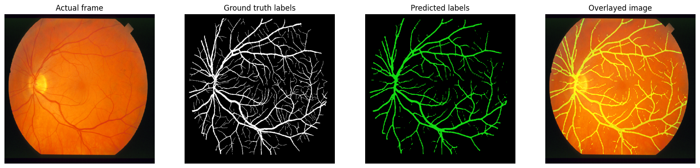

# 🩺 Retinal Blood Vessel Segmentation with SegFormer

<p align="center">
  
</p>

<p align="center">
  
  
  
  
  
  
</p>

---

## 📌 Overview

Semantic segmentation of retinal blood vessels from fundus photography, targeting early detection of **Diabetic Retinopathy (DR)** — a leading cause of preventable blindness worldwide.

This project fine-tunes **NVIDIA's SegFormer-B3** on the **ICPR Retinal Blood Vessels Dataset**, achieving **78.02% mIoU** on the test set after 60 epochs of training on an A100 GPU.

> **Clinical Motivation:** DR affects ~1 in 3 people with diabetes. Accurate vessel segmentation enables automated, scalable screening — reducing costs and improving access to diagnosis in under-served populations.

---

## 📊 Results

| Metric | Score |
|--------|-------|
| **mIoU (Test Set)** | **78.02%** |
| Epochs | 60 |
| Backbone | SegFormer-B3 |
| GPU | NVIDIA A100 |
| Loss | Dice + Cross-Entropy |

---

## 🏗️ Architecture

- **Backbone**: `nvidia/segformer-b3-finetuned-ade-512-512` (pretrained on ADE20K)
- **Fine-tuned** for binary segmentation: `vessel` vs `background`
- **Loss**: Combo loss — Dice coefficient loss + Cross-Entropy
- **Optimizer**: AdamW (`lr=3e-4`, `wd=1e-4`, `amsgrad=True`)
- **Scheduler**: MultiStepLR (decay at epoch 30)
- **Mixed Precision**: AMP (`torch.cuda.amp`)
- **Input Size**: 576 × 576

### Why SegFormer?
SegFormer uses a hierarchical Transformer encoder without positional encoding, combined with a lightweight MLP decoder. This gives it strong semantic understanding and better generalization vs. pure CNN approaches (U-Net, DeepLab).

---

## 📁 Dataset

**ICPR Retinal Blood Vessels Dataset**
- **Train**: 268 images + pixel-level masks
- **Test**: 112 images + pixel-level masks
- **Classes**: 2 — `background (0)`, `vessel (1)`
- **Format**: `.tif` / `.png` / `.jpg`

```
icpr_prepared/
├── train_images/   # 268 retinal fundus images
├── train_labels/   # 268 binary segmentation masks
├── test_images/    # 112 retinal fundus images
└── test_labels/    # 112 binary segmentation masks
```

> **Note:** The dataset is not included in this repository. Download it from the [ICPR 2018 Challenge](https://idrid.grand-challenge.org/) and place it in the root as `icpr_prepared/`.

---

## ⚙️ Setup & Installation

### 1. Clone the Repository
```bash
git clone https://github.com/523vishwanath/retinal-vessel-segmentation.git
cd retinal-vessel-segmentation
```

### 2. Create a Virtual Environment
```bash
python -m venv venv
source venv/bin/activate        # Linux/Mac
# venv\Scripts\activate         # Windows
```

### 3. Install Dependencies
```bash
pip install -r requirements.txt
```

### 4. Configure WandB (optional but recommended)
```bash
wandb login
```

---

## 🚀 Training

```bash
python src/train.py
```

Key hyperparameters are controlled via the dataclasses in `src/config.py`. Update the dataset path before running:

```python
# src/config.py
TRAIN_IMAGES_DIR = "icpr_prepared/train_images"
TRAIN_LABELS_DIR = "icpr_prepared/train_labels"
```

---

## 🔍 Inference

```bash
python src/inference.py --checkpoint checkpoints/best_model.tar
```

This loads the best checkpoint, runs inference on the test set, and visualizes:
- Original fundus image
- Ground truth mask
- Predicted vessel mask (green overlay)
- Overlay on original image

---

## 🧪 Evaluation

```bash
python src/evaluate.py --checkpoint checkpoints/best_model.tar
```

Reports mIoU and pixel accuracy on the test set.

---

## 📦 Project Structure

```
retinal-vessel-segmentation/
├── assets/
│   └── inference_sample.png       # Sample inference output
├── src/
│   ├── config.py                  # All hyperparameters & configs
│   ├── dataset.py                 # CustomSegDataset + DataLoader
│   ├── model.py                   # SegFormer model factory
│   ├── losses.py                  # Dice + CE combo loss
│   ├── metrics.py                 # mIoU implementation
│   ├── train.py                   # Training loop
│   ├── evaluate.py                # Evaluation script
│   ├── inference.py               # Inference + visualization
│   └── utils.py                   # Seed, denormalize, color helpers
├── notebooks/
│   └── icpr_segmentation.ipynb    # Full experiment notebook
├── requirements.txt
├── .gitignore
└── README.md
```

---

## 🔬 Key Design Decisions

### 1. Synchronized Augmentation with Albumentations
Geometric augmentations (flip, rotate, scale) are applied **jointly** to image-mask pairs using `albumentations.Compose`, ensuring mask spatial consistency with the transformed image.

### 2. Combo Loss (Dice + CE)
Standard cross-entropy alone struggles with class imbalance (vessels occupy ~10% of pixels). The Dice loss component directly optimizes for overlap between predicted and ground truth masks.

```
L_combo = (1 - Dice) + CrossEntropy
```

### 3. Mixed Precision Training
`torch.cuda.amp.GradScaler` + `autocast()` reduces memory footprint and speeds up training ~2x on A100, enabling larger batch sizes.

### 4. SegformerImageProcessor
Uses HuggingFace's built-in processor for resizing, normalization, and correct tensor formatting — keeping preprocessing consistent between training and inference.

---

## 📈 Training Curves

WandB run: https://wandb.ai/vninganolla-florida-state-universit/ICPR_BloodVessels_segmentation?nw=nwuservninganolla

Metrics tracked per epoch:
- `loss` / `val_loss`
- `IoU` / `val_IoU`
- `accuracy` / `val_accuracy`

---

## 🛠️ Tech Stack

| Component | Tool |
|-----------|------|
| Framework | PyTorch 2.x |
| Model | HuggingFace Transformers (SegFormer-B3) |
| Augmentation | Albumentations |
| Experiment Tracking | Weights & Biases |
| Metrics | TorchMetrics |
| Hardware | NVIDIA A100 (Google Colab / Cloud) |

---

## 📚 References

- [SegFormer: Simple and Efficient Design for Semantic Segmentation with Transformers](https://arxiv.org/abs/2105.15203) — Xie et al., NeurIPS 2021
- [IDRiD: Diabetic Retinopathy – Segmentation and Grading Challenge](https://idrid.grand-challenge.org/)
- [ICPR 2018 Retinal Blood Vessel Segmentation](https://ieeexplore.ieee.org/document/8545126)
- [Albumentations Documentation](https://albumentations.ai/docs/)

---

## 📄 License

This project is licensed under the MIT License. See [LICENSE](LICENSE) for details.

---

## 🤝 Contributing

Pull requests are welcome. For major changes, please open an issue first to discuss what you would like to change.

---

<p align="center">Made with ❤️ for Computer Vision & Medical Imaging</p>
